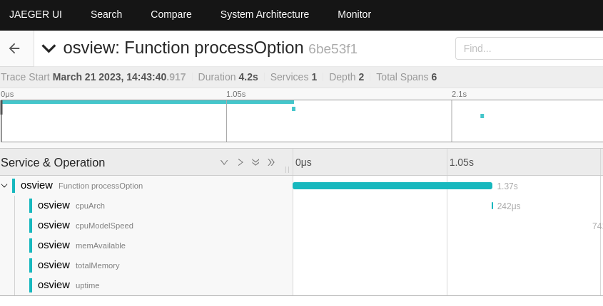
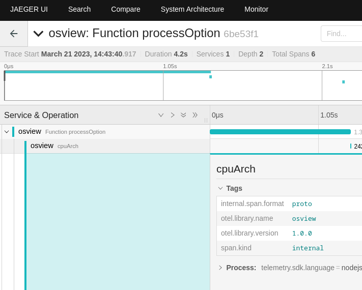
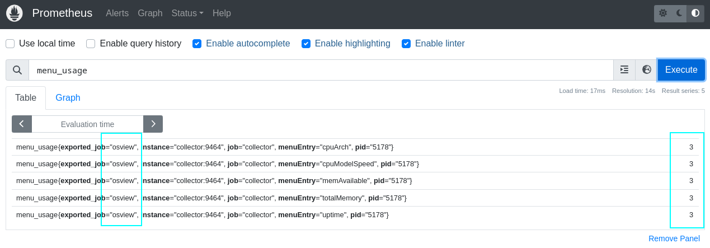

# osview

> OTEL-JS packages in use:

| Package | |
| ----------- | ----------- |
| @opentelemetry/exporter-trace-otlp-http | To export to OTEL collector via OTLP/HTTP |
| @opentelemetry/resources | To be used with `semantic-conventions` to identify the application/service's name |
| @opentelemetry/sdk-trace-base | For manual instrumentation  |
| @opentelemetry/semantic-conventions | To be used with `resources` to identify the application/service's name |
| @opentelemetry/api | To get the trace instance and control spans creation |
| @opentelemetry/sdk-metrics | For manual instrumentation |
| @opentelemetry/exporter-metrics-otlp-proto | To export the metrics using the OTEL collector |

Open a terminal and run

```
docker-compose up
```

Open other terminal and run

```shell
npm install
npm run build
npm start
```

```shell
➜  osview git:(main) ✗ osview

  ----------------------------------------
  Please type one option:
  a --> CPU Arch
  c --> CPU(s) Info
  m --> Available memory
  t --> Total memory
  u --> Uptime
  q --> Quit
  ----------------------------------------
Arch: x64 bits
CPU(s):
[
  'Model: 11th Gen Intel(R) Core(TM) i7-1185G7 @ 3.00GHz current speed: 1200 MHz',
  'Model: 11th Gen Intel(R) Core(TM) i7-1185G7 @ 3.00GHz current speed: 1082 MHz',
  'Model: 11th Gen Intel(R) Core(TM) i7-1185G7 @ 3.00GHz current speed: 3000 MHz',
  'Model: 11th Gen Intel(R) Core(TM) i7-1185G7 @ 3.00GHz current speed: 1127 MHz',
  'Model: 11th Gen Intel(R) Core(TM) i7-1185G7 @ 3.00GHz current speed: 1193 MHz',
  'Model: 11th Gen Intel(R) Core(TM) i7-1185G7 @ 3.00GHz current speed: 1001 MHz',
  'Model: 11th Gen Intel(R) Core(TM) i7-1185G7 @ 3.00GHz current speed: 3000 MHz',
  'Model: 11th Gen Intel(R) Core(TM) i7-1185G7 @ 3.00GHz current speed: 1182 MHz'
]
Available memory: 28881 MB
Total memory: 31804 MB
862 minutes up
Bye
```

After selecting some options from the menu you can access Jaeger and Prometheus
to see both traces and metrics.





Each menu option was selected 3 times


